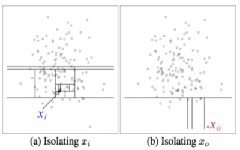

## Introduction

Phishing - stealing personal or business information by sending fraudulent emails impersonating a legitimate contact - is an increasingly prevalent form of cyberattack (Anti-Phishing Working Group, 2020). While many types of phishing rely on impersonating organizations (such as banks), others attempt to impersonate people the user may know to render the user less suspicious when confronted with a request to click on an unknown link. While email display names and headers can be easily altered, forging someone's writing style is much more difficult, making this a detection method harder for cybercriminals to avoid.

## Problem Definition

Given a large sample of emails written by one person and a large sample of emails not written by that person, we will determine if a new email was written by that person or by someone else impersonating them.

## Data Collection and Cleaning

### Summary

We were able to obtain a dataset consisting of emails from 150 members of Enron management (Cohen, 2015). We start by selecting only the emails a user has sent so that we are certain of the true author. After that, we execute a series of cleaning steps on each email's text, removing numbers and symbols and anonymizing names. We also eliminate duplicate email and emails which are too short or too long, resulting in a collection of 25,249 clean body texts. These are distributed unevenly among users; even though this averages out to about 170 emails/user, some users have over 1000 eligible emails. We choose only the body text for analysis, ignoring any headers (such as date or subject), since we want to analyze the email's writing style. We neglect the date because we assume a user's writing style changes slowly over time.

### 1. Parsing out the email body text

|                    |
| :---------------------------------------: |
| _Figure 1. A raw email from the dataset._ |

As can be seen in Figure 1, an email has 4 components (rarely 5):

1.  The standard email headers (`Message-ID: `, `From: `, etc.)
2.  The X headers, which all start with `X-`
3.  The email body written by the user.
4.  A quoted message that is being forwarded or replied to (if present).
5.  A news article forwarded in-line (extremely rare).

We are only interested in component 3, the email body text. To extract it we parse the email line-by-line. We start recording the body text after the last X header and continue recording until either we reach the end of the email or we encounter a quoted reply. We also are careful to remove any tabs, empty lines, and extraneous whitespace. We then merge the text into a single line.

#### Determining the start of the quoted reply

Unfortunately, while all emails have the same format for the standard headers and X headers, there are many different methods of delimiting a quoted message. Some messages have no delimiter at all. We therefore have several different criteria for determining if a line is a delimiter:

- If the line contains `----Original Message----`, `---- Forwarded `, or similar dividers
- If the line start with `To: `, `From: `, `cc: `, or `CC: `, which indicates we encountered the headers of a quoted reply
- If the line contains `Enron@Enron`, a non-existent email that was added by the dataset maintainers in place of certain emails in the headers. This indicates we encountered an email header again, which indicates we encountered a reply
- If the line contains an email address surrounded by brackets, such as `<vader@empire.net>`. This is a moderately common format for email addresses in a header.
- If the line contains `(Reuters)`, which indicates we have encountered a news article attached inline

### 2. Removing numbers and symbols

After getting the message body text in a single line we remove all letters, symbols, and punctuation, which interfere with turning the email into a feature vector. We only keep spaces and letters.

### 3. Removing ineligible emails

After we have the cleaned email body text, we removed all duplicate messages. We then remove any messages with body text shorter than 200 characters, as emails shorter than this are too short for meaningful authorship analysis (ex. "Yes", "FYI", "I'm fine with it"). We also remove messages with body text longer than 3000 characters, as our examination showed that these often included inline attachments our parser had missed, while few real email bodies are this long.

### 4. Anonymizing names

It is a common practice to sign emails with one's own name, however, this has the potential to inflate our accuracy score. The email dataset we have was written by users who were not attempting to impersonate each other, so they each signed their own name at the bottom of the email. Therefore, to distinguish between them our algorithm might just learn to read the message signature, which defeats the point - a forged message would certainly have the name of the purported sender.

To combat this, we replace all names in the email with the tokens `NameA`, `NameB`, etc. We search each email for 1647 unique names. The list of names is derived from the 1000 most common last names in the 2010 census (US Census Bureau), the 200 most common first names for babies in the 1950's, 60's, 70's, and 80's as well as the last 100 years as a whole (US Social Security Administration), the last names of every user in the Enron dataset, and a few extra names we found missed by the above techniques. We then removed the names `Buy`, `Cash`, `Gang`, `Gay`, `Lay`, `Love`, `May`, `Parks`, `Ring`, `South`, `White`, and `Zipper` from our list since those are more commonly used as words.

The final cleaned email appears as seen in Figure 2. We have 25,249 clean emails across 150 users.

|  |
| :-----------------------------------------------------: |
|              _Figure 2. A cleaned email._               |


## Methods

### Unsupervised

An unsupervised approach may be to directly identify outlier emails using an unsupervised learning approach such as Isolation Forest (Liu et al., 2008). This approach works by looking at a number of emails from a dataset or all if chosen, and partitions these emails. Once partitioned, the algorithm can identify anomalies based on features.

#### Isolation Forest

The principle idea of the algorithm is isolating anomalies by implementing decision trees over random attributes. This algorithm randomly selects a feature from the given set of dataset and randomly selects a split value between the maximum and minimum value of the selected feature through recursive calls; each line in Figure 3 represents each partitioning process.  The random partitioning helps us to produce shorter paths for anomalies since distinguishable attribute values are more likely to be separated in early partitioning. Once the recursive partitioning is completed and successfully reaches the external nodes of the tree, which are leaf nodes that could not be split further, the distance taken to reach the normal data is far more than the distance taken to reach the outliers. Hence, some particular points with the shorter path length produced by random forests are expected to be anomalies as shown in Figure 4.  
|                            |                            |
|  :---------------------------------------------:  |  :---------------------------------------------:  |
| _Figure 3. SVM with count vectorizer_             | _Figure 4. SVM with tfidf vectorizer_             |


### Supervised

We propose the Support Vector Machine (SVM) method as the supervised algorithm for this project. We chose this algorithm due its ability to detect outliers from data belonging to a single class (Mahbubul, 2020). In our case, SVM will essentially separate words into new word or not new classification categories.

#### SVM

Before starting to use text data for predictive modeling, we have parsed it to remove words. Then we performed vectorization by encoding the words as numerical values to use as input to a Support Vector Machine. We were able to achieve our goal by importing a scikit-learn library that offers tools for vectorization and feature extraction of our pre-processed email data. We used the SVM algorithm to classify data points into 2 classes by plotting each data item as a point in n-dimensional (where n is a number of features we have) space with the value of each feature being the value of a particular coordinate. To find the hyper-plane that differentiates the two classes, we decided to use Radial Basis Function(RBF) Kernel because of its ability to overcome the space complexity as it only requires storing the support vectors during training instead of the entire dataset.

|                     |
| :-----------------------------------------------------: |
|   _Figure 5. An explanation of how RBF Kernel works._   |

#### Naive Bayes

In addition to SVM, we experimented with using different types of Naive Bayes classifiers for detecting outliers. Naive Bayes aims to predict the probability of a word being contained in a given corpus by using Bayes rule. The reason why it is naive is because we are assuming that the features are i.i.d, or, in other words, the location of a given n-gram in a corpus is random. We chose to use the `GaussianNB` classifier for this project due to the hypothesis that the features of our dataset can be approximated by a gaussian distribution.

### Converting emails into features

#### Data preprocessing

Before we transform the email into a feature vector, we remove all words shorter than 3 letters (ex. 'and', 'but', 'or') and all english stopwords, as these usually add little to the meaning of the text (Hvitfeldt, Ch. 3). This reduces the dimensionality of the email.

We had also used 2 different methods to reduce inflectional forms and sometimes derivationally related forms of a word to a common base form. These two methods are both test normalization techniques  that are used to prepare text, words, and documents for further processing

For Method 1, we had used the Porter Stemming Algorithm, which is a process for removing the commoner morphological and inflexional endings from words in English. For example: words such as “Likes”, ”liked”, ”likely” and ”liking” will be reduced to “like” after stemming.

For Method 2, we used lemmatization, which is the process of grouping together the different inflected forms of a word so they can be analysed as a single item, which is the base or dictionary form of a word, which is known as the lemma . Basically, it links words with similar meaning to one word. For instance: Forms suchs as studies, and studying will return to the lemma 'study'.


#### Converting to feature vectors

We used the method of Term Frequency — Inverse Document Frequency (TF-IDF) to represent our data. TF-IDF gives us a way to determine how meaningful a term is in relation to the document as a whole (Manning et al., 2008). TF-IDF builds on the well-known bag-of-words representation and our results show that vectorizing our data using TF-IDF performs better when compared to the bag-of-words vectorizer.

|                  |
| :---------------------------------------------: |
| _Figure 6. An explanation of how TF-IDF works._ |

|              |
| :-----------------------------------------------------: |
| _Figure 7. The most common terms in the Enron emails. These are all very common terms in emails (with the exception of ```enron```, which is to be expected given the subject matter)._  |

### Dimensionality Reduction

Without using dimensionality reduction, our vectorized training dataset had very high dimensionality. In order to increase the performance of our iForest and Naive Bayes models we had to apply dimensionality reduction methods. We used a univariate feature selection method which will select the top 10% scoring features using a scoring function which uses the Analysis of variance (ANOVA) F-value (Scikit-learn) to get rid of features that are highly correlated. After applying this feature selection method we were able to decrease the dimensionality of our dataset significantly.

## Results

### SVM
SVM does well at distinguishing between email authors. This is the confusion matrix for the SVM classifier on the email authors mann-k (label 1) and perlingiere-d (label -1), each of whom has written slightly over 1000 valid emails.

|                            |                            |
|  :---------------------------------------------:  |  :---------------------------------------------:  |
| _Figure 8. SVM with count vectorizer_             | _Figure 9. SVM with tfidf vectorizer_             |

We additionally tested the effects of including a limited amount of punctuation (```, . ' "```) as tokens for our vectorizer to consider. This resulted in almost no change in accuracy.

|                          |                              |
|  :---------------------------------------------:      |  :---------------------------------------------:          |
| _Figure 10. SVM with punctuation and count vectorizer_ | _Figure 11. SVM with punctuation and TF-IDF vectorizer_   |

We see that SVM has uniformly high (>90%) accuracy as distinguishing between two email authors. While the using the TF-IDF vectorizer appears to be slightly more accurate than using the count vectorizer, this varies depending on which users we choose to compare. Similarly, including punctuation has a small effect on accuracy and whether the effect is positive or negative appears to depend on which users we compare.

We also experimented with the idea of visualizing the decision boundary for SVM. As SVM works to separate high dimensional data, visualizing the boundaries for an RBF kernel were non-trivial with our dataset left unchanged. Luckily, we were able to utilize two of the principle components to visualize the decision boundary contour better.

|      |
| :-----------------------------: |
| _Figure 12. PCA and SVM Decision Boundary._  |

### Isolation Forest

In our experimentations using the Isolation Forest algorithm, we were able to achieve an accuracy of 85% after fitting the iForest to the training data and selecting the top 10% features with the highest F-value which aims to get rid of highly correlated features. Prior to doing this, we achieved an accuracy score of less than 50%. There are a number of reasons for this. It was expected that the accuracy may appear low for the emails when there is a varying density of the emails and their formality. Additionally, many false positives can be displayed when email authors have similar message style, length, and use formal communication as seen standard in a corporate environment. We believe that improvements can be made if we used true anomalies instead of other employees who implore synonymous dictation. In a scenario where emails are sent out regularly, we may capture an anomaly by comparing the previous 100 to 1000 emails to the next email sent. This would allow us to easily identify future emails which were not authored or authorized by the primary email account holder. Below, we show the results where we have the author Arnold J. and use Bailey S. and Bailer S. as outliers for the training and testing using PCA and final result using Isolation Forest. 

In the first two visualizations we overlay the ground truth outliers of both the testing and training portions of our dataset. In the third visualization we overlay a contour plot of the decision function mapped to 2D space. This overlay gives some intuition as to how the iForest decision function plays into the selection of outliers in the dataset. As the contour get's darker, the decision function gets more and more negative indicating data which is more likely to be an outlier.

|      |
| :-----------------------------: |
| _Figure 13. PCA and iForest Results._  |


### Naive Bayes

Similar to the iForest method, we utilized the same feature selection method for Naive Bayes by choosing the top 10% of features based on the ANOVA F-value (or F-statistic). Using this method we were able to decrease the dimensionality of our dataset by a significant amount. We then experimented with using a gaussian Naive Bayes classifier on our dataset. We saw good performance from this model with regards to accuracy (89%) but saw decreased f1-scores for the outlier labels when compared with the SVM classifier.

|                      |                              |
|  :---------------------------------------------:  |  :---------------------------------------------:          |
| _Figure 14. Naive Bayes Classifier Results Table_ | _Figure 15. Naive Bayes Classifier Confusion Matrix_   |


## Discussion

Email's short messages present a challenge to determining authorship. Our methods provide a respectably reliable method of determining authorship of medium-length emails, however, a system to detect false authorship based on our current results would likely have an unacceptably high false positive rate. We experimented with adding punctuation usage to increase the accuracy (one of the authors can distinguish his emails from his father's by counting the number of ellipses), however, the realized accuracy gain was minimal.

We achieved our highest accuracies by training a SVM classifier to distinguish between the emails sent by two different authors, however, this is not a likely real-world scenario: it is not so often that one checks their email and sees hundreds or even thousands of emails sent unknowingly on their behalf. For this reason, it is not ideal to singly use a supervised method of anomaly detection (SVM or Naive Bayes) if there are few anomalous emails to test against from the start. Despite its lower accuracy (we achieved 85% accuracy after using dimensionality reduction), the unsupervised isolation forest offers the significant advantage that large quantities of fradulent emails are not required for training and therefore is a more promising candidate for future research.

## Conclusion

In this report, given a large sample of emails written by one person and a large sample of emails not written by that person, we will be able to determine whether a new email (supposedly) written by the same author should be flagged or not. In this way, we are attempting to simulate an external entity taking over a persons email account. We have attempted various methods to gain more accurate results. We see that whether we use Porter Stemming, or Lemmatization methods, there was little to no change in the performance metrics. Furthermore, the classifiers showed a small performance boost when using the TF-IDF vectorizer compared to the count vectorizer. The accuracy results for the iForest method were not as promising as we had initially hoped. Additionally, the Naive Bayes classifier did not outperform the SVM classifier. All in all, the SVM classifier proved to perform the best on our high-dimensional email data. For future extensions of this project, we believe that training on true email anomalies could boost some of the performance values for the models like iForest and Naive Bayes. A reliable method to flag if an email was not written by its claimed author could provide another layer of security against identity theft.

## Group member contributions

### Peter Wilson
 * Located dataset
 * Wrote data parsing and cleaning (not preprocessing) Python code
 * Wrote the Introduction and Data Collection and Cleaning sections of the report
 * Wrote SVM section of Results, using analysis scripts prepared by different group members

### Samuel Gamage
 * Co-Authored SVM and Isolation Forest method code with Isaac King
 * Wrote Naive Bayes method code
 * Wrote python code for all the visualizations
 * Wrote python code for bag-of-words and TF-IDF vectorization
 * Wrote python code for retrieving data
 * Wrote Naive Bayes method and results for final report

### Vy Le
 * Wrote Porter Stemming and Lemmatization Algorithm Python code
 * Wrote parts of Data Preprocessing, Results, and Conclusion for the report
 * Made the Powerpoints and recorded the videos for the presentation
 
### Isaac King
 * Wrote part of the iForest result section for final report
 * Wrote the unsupervised section for final report
 * Wrote the discussion section for final report
 * Co-Authored SVM and iForest method code with Samuel Gamage
 
### Yeajin Shin
 * Wrote SVM method for the final report
 * Wrote Isolation Forest method for the final report
 
## References

Anti-Phishing Working Group. _Phishing Activity Trends Report_. Anti-Phishing Working Group. https://docs.apwg.org/reports/apwg_trends_report_q4_2020.pdf

Christopher D. Manning, Prabhakar Raghavan and Hinrich Schütze (2008), _Introduction to Information Retrieval_, Cambridge University Press.

Cohen, W. W. (2015). _Enron Email Dataset_ [Text emails]. https://www.cs.cmu.edu/~enron/

F. T. Liu, K. M. Ting and Z. Zhou, "Isolation Forest," 2008 Eighth IEEE International Conference on Data Mining, Pisa, Italy, 2008, pp. 413-422, doi: 10.1109/ICDM.2008.17

Hvitfeldt, E. and Silge, J. (2021). _Supervised Machine Learning for Text Analysis in R: Chapter 3_. Supervised Machine Learning for Text Analysis in R. https://smltar.com/stopwords.html

Liu, F. (2008). Isolation Forest. Retrieved from https://cs.nju.edu.cn/zhouzh/zhouzh.files/publication/icdm08b.pdf

Mahbubul, A. (2020). _Support Vector Machine (SVM) for Anomaly Detection_. Towards Data Science. https://towardsdatascience.com/support-vector-machine-svm-for-anomaly-detection-73a8d676c331?gi=57bd1c22dc72

Radim Řehůřek and Petr Sojka (2010). _Software Framework for Topic Modelling with Large Corpora_. Proceedings of the LREC 2010 Workshop on New Challenges for NLP Frameworks. http://is.muni.cz/publication/884893/en

Scikit-learn: Machine Learning in Python, Pedregosa et al., JMLR 12, pp. 2825-2830, 2011

Sreenivasa, S. (2020, October 12). Radial Basis Function (RBF) Kernel: The Go-To Kernel. Medium. https://towardsdatascience.com/radial-basis-function-rbf-kernel-the-go-to-kernel-acf0d22c798a

Tweney, D. (2019). (rep.). Billions of fake emails every day — and most industries still vulnerable. Vailmail. Retrieved from https://valimail.docsend.com/view/qndhuhn

US Census Bureau (2016). _Frequently Occurring Surnames from the 2010 Census_. US Census Bureau. https://www.census.gov/topics/population/genealogy/data/2010_surnames.html

US Social Security Administration. _Top names of the 1950s_. US Social Security Administration. https://www.ssa.gov/OACT/babynames/decades/names1950s.html

US Social Security Administration. _Top names of the 1960s_. US Social Security Administration. https://www.ssa.gov/OACT/babynames/decades/names1960s.html

US Social Security Administration. _Top names of the 1970s_. US Social Security Administration. https://www.ssa.gov/OACT/babynames/decades/names1970s.html

US Social Security Administration. _Top names of the 1980s_. US Social Security Administration. https://www.ssa.gov/OACT/babynames/decades/names1980s.html

US Social Security Administration (2020). _Top Names Over the Last 100 Years_. US Social Security Administration. https://www.ssa.gov/OACT/babynames/decades/century.html

Vlaseveld, R. (2013). _Introduction to One-class Support Vector Machines_. Roemer's blog. https://rvlasveld.github.io/blog/2013/07/12/introduction-to-one-class-support-vector-machines/

Vert, J. P., Tsuda, K., & Schölkopf, B. (2004, August 1). Kernel Methods in Computational Biology. The MIT Press. http://members.cbio.mines-paristech.fr/~jvert/publi/04kmcbbook/kernelprimer.pdf
